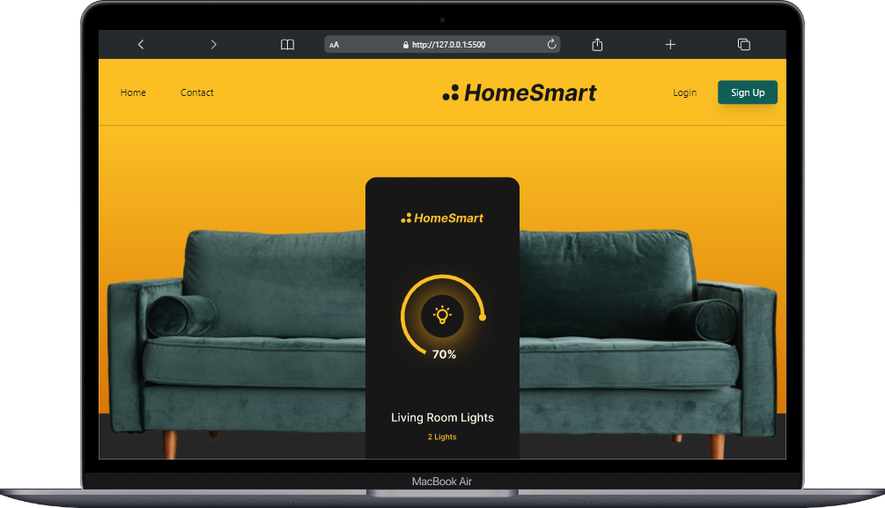

<!-- TABLE OF CONTENTS -->

  
Table of Contents

  <ol>
    <li>
      <a href="#about-the-project">About The Project</a>
      <ul>
        <li><a href="#built-with">Built With</a></li>
      </ul>
    </li>
    <li>
      <a href="#getting-started">Getting Started</a>s
    </li>
    <li><a href="#contact">Contact</a></li>
  </ol>

<!-- ABOUT THE PROJECT -->

## About The Project

## TWITTER/HOME-PAGE

This is the cloned version of Home Smart Project

### Built with

HTML
Tailwindcss
JavaScript

### Contact

Twitter: https://twitter.com/henryIgweDev

LinkedIn : https://linkedin.com/in/henryigwedev

Projectlink: https://homesmart-project.netlify.app/
